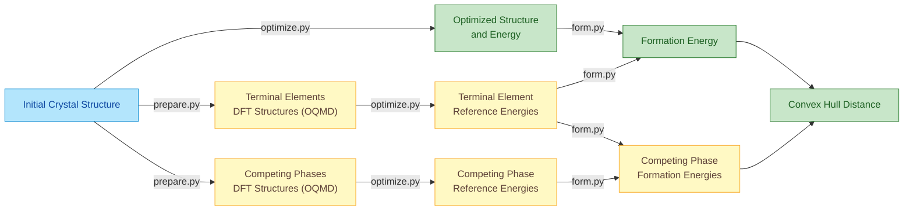

# MLFF Script Collection

A comprehensive toolkit for Machine Learning Force Field (MLFF) calculations, including formation energy evaluation, convex hull analysis, and structural optimization.

## Overview

This repository contains Python scripts and examples for:
- **Formation Energy Calculation**: Calculate formation energies using ML energies and reference terminal elements
- **Convex Hull Analysis**: Prepare competing phases from OQMD database and evaluate hull distances
- **Structural Optimization**: Optimize crystal structures using various ML force fields (CHGNet, EquiformerV2, etc.)

## Common Workflow

The MLIP-based structure optimization, formation energy calculation, and distance to convex hull calculation are performed following this sequential process:



## Scripts Usage
We show the usage of scripts using an example of 100 compounds. 

### Core Scripts

#### 1. `ML_formE.py`
Calculates formation energies from ML-predicted energies and terminal element references.

**Usage:**
```bash
python ML_formE.py \
  -f <database_folder> \
  -n <database_name_pattern> \
  -t <terminal_elements_db> \
  -o <output_file>
```

**Parameters:**
- `-f, --database_folder`: Path to the compound database CSV files folder
- `-n, --database_name`: Glob pattern for database CSV files (e.g., "db*convex*.csv")
- `-t, --database_terminal`: Terminal elements energy database CSV file
- `-o, --output`: Output CSV file name
- `--formula_column_compound`: Column name for formulas in compound DB (default: "composition")
- `--formula_column_terminal`: Column name for formulas in terminal DB (default: "element")
- `--energy_column`: Column name for ML energies (default: "ML_e")

#### 2. `ML_hull_prepare.py`
Extracts competing phases from OQMD database for convex hull analysis.

**Requirements:**
- Access to OQMD database
- MPI for parallel processing

**Usage:**
```bash
mpirun -np <num_processes> python ML_hull_prepare.py \
  --database_candidate <candidate_compounds.csv> \
  --output <output_competing_phases.csv>
```

#### 3. `ML_hull_evaluate.py` 
Evaluates convex hull distances using ML formation energies.

**Usage:**
```bash
mpirun -np <num_processes> python ML_hull_evaluate.py \
  --database_candidate <candidate_compounds.csv> \
  --database_convex <competing_phases.csv> \
  --output <hull_results.csv> \
  --formula_column_candidate <composition_column> \
  --formula_column_convex <name_column> \
  --formE_column_candidate <ML_formE_column> \
  --formE_column_convex <ML_formE_column>
```

#### 4. `ML_optimization.py`
Performs structural optimization using various ML force fields.

**Supported Models:**
- CHGNet
- EquiformerV2 (various sizes: 31M, 86M, 153M parameters)
- ESEN
- HIENet
- Matter-Sim
- FairChem

## Installation

### Prerequisites
```bash
# Core dependencies
pip install pandas numpy pymatgen ase tqdm spglib

# For OQMD database access (hull_prepare.py)
pip install pymysql qmpy

# For parallel processing
pip install mpi4py

# For specific ML models (choose based on your needs)
pip install chgnet  # For CHGNet
# Additional model-specific installations may be required
```

### Environment Setup
Create a conda environment with required packages:
```bash
conda create -n mlff_env python=3.9
conda activate mlff_env
pip install -r requirements.txt  # (create based on your needs)
```

## Usage Examples

### Basic Workflow

#### 1. Calculate Formation Energies
```bash
python ML_formE.py \
  -f ./compound_databases/ \
  -n "compounds_*.csv" \
  -t ./terminal_elements.csv \
  -o ./formation_energies.csv
```

#### 2. Prepare Competing Phases (requires OQMD access)
```bash
mpirun -np 10 python ML_hull_prepare.py \
  --database_candidate ./candidates.csv \
  --output ./competing_phases.csv
```

#### 3. Evaluate Hull Distances
```bash
mpirun -np 10 python ML_hull_evaluate.py \
  --database_candidate ./formation_energies.csv \
  --database_convex ./competing_phases_formE.csv \
  --output ./hull_distances.csv \
  --formula_column_candidate composition \
  --formula_column_convex name \
  --formE_column_candidate ML_formE \
  --formE_column_convex ML_formE
```

### Parallel Job Submission

The `example/` folder contains shell scripts for job submission on HPC clusters:

#### Submit Multiple Parallel Jobs
```bash
./example/0_loop.sh job_template.sh 10  # Submit 10 parallel jobs
```

#### Run CHGNet Calculations
```bash
# Edit example/0_run_chgnet.sh to configure your settings
qsub example/0_run_chgnet.sh
```

## File Format Requirements

### Input CSV Format
- **Compound Database**: Must contain columns for composition and ML energies
- **Terminal Elements Database**: Must contain columns for elements and their reference energies

### Example Data Structure
```csv
# compounds.csv
composition,ML_e,other_properties
Fe2O3,-5.234,additional_data
Al2O3,-8.567,additional_data

# terminal_elements.csv  
element,ML_e
Fe,-4.123
Al,-3.456
O,-2.789
```

## Configuration

### Database Connection (for hull_prepare.py)
Set environment variables for OQMD database access:
```bash
export qmdb_v1_1_name="oqmd__v1_6"
export qmdb_v1_1_user="your_username"
export qmdb_v1_1_host="localhost"
export qmdb_v1_1_pswd="your_password"
```

### Model Selection
In the optimization scripts, you can choose from various ML models:
- `chgnet`: CHGNet model
- `eqV2_31M_omat_mp_salex`: EquiformerV2 31M parameters
- `eqV2_86M_omat_mp_salex`: EquiformerV2 86M parameters  
- `eqV2_153M_omat_mp_salex`: EquiformerV2 153M parameters
- `esen_30m_oam`: ESEN model
- `hienet`: HIENet model

## Notes

- **Energy Units**: All energies are in eV per atom
- **Parallel Processing**: Scripts using MPI require proper MPI installation and setup
- **Database Access**: `ML_hull_prepare.py` requires access to OQMD database
- **Memory Requirements**: Large datasets may require significant memory, especially for hull calculations

## Citation

If you use this code in your research, please cite the relevant papers associated with the ML models and databases used.

## Contributing

Feel free to submit issues and enhancement requests. Pull requests are welcome.

## License

[Add your chosen license here]

## Contact

[Add your contact information here]