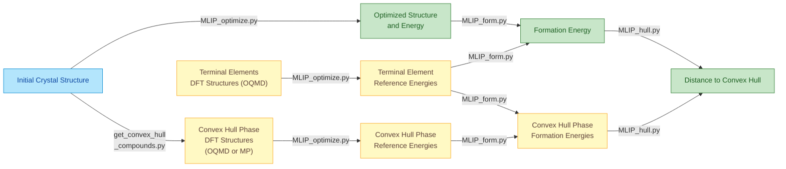

# MLIP-based High-throughput Optimization and Thermodynamics (MLIP-HOT)

A comprehensive toolkit for Machine Learning Interatomic Potential (MLIP) based
calculations, including structural optimization, formation energy evaluation and
convex hull analysis. This toolkit focuses on building a high-throughput pipline
for computational material discovery.


## Overview

This repository contains Python scripts and examples for:
- **Formation Energy Calculation**: Calculate formation energies using ML energies and reference terminal elements
- **Convex Hull Analysis**: Prepare competing phases from OQMD database and evaluate hull distances
- **Structural Optimization**: Optimize crystal structures using various ML force fields (CHGNet, EquiformerV2, etc.)
## Key Features

- **MPI Parallelization**: Efficient processing of large datasets through distributed computing
- **Flexible Job Distribution**: Submit dataset chunks separately across multiple computing resources
- **Global Minimum Determination**: Identify the lowest-energy structure from multiple optimization runs with different initial configurations
- **Formation Energy Calculations**: Compute formation energies using MLIP-derived reference energies
- **Convex Hull Distance Analysis**: Evaluate thermodynamic stability through hull distance calculations with MLIP reference energies
- **High-Quality Reference Structures**: Utilize DFT-optimized structures from OQMD and Materials Project databases as initial geometries for reference energy calculations
- **Symmetrize** The structure can be converted to primitive cell before optimization.


## Available MLIP Models

This toolkit supports the following Machine Learning Interatomic Potential models:

- **CHGNet**: `chgnet` 
- **SevenNet variants**:
  - `7net-0` 
  - `7net-l3i5` 
  - `7net-mf-ompa` 
- **MatterSim**: `mattersim` 
- **EquiformerV2 (OMAT)**:
  - `eqV2_31M_omat` 
  - `eqV2_86M_omat` 
  - `eqV2_153M_omat` 
  - `eqV2_31M_omat_mp_salex` 
  - `eqV2_86M_omat_mp_salex` 
  - `eqV2_153M_omat_mp_salex` 
- **eSEN**: `esen_30m_oam`
- **HIENet**: `hienet` 

For MLIP installation instructions, please refer to the **MLIP package installation** section below.

The toolkit is designed with modularity in mind, allowing new MLIP models to be integrated seamlessly into the existing framework.

## Common Workflow

The MLIP-based structure optimization, formation energy calculation, and distance to convex hull calculation are performed following this sequential process:



## Usage Examples

An example input csv file containing 100 compounds is included in `example`. It
can be used to execute the examples below. We first give the typical usages of
each script. At the end, we give a comprehensive example of a common job
workflow: determine the structure and energy of the ground states, and calculate
formation energy and distance to convex hull to evaluate thermodynamic stability
of the ground state.

### 1. Structure Optimization

#### Basic Structure Optimization

Optimization of crystal structures using different MLIP models is done using
`MLIP_optimize.py`. The input csv file includes initial guess of crystal
structure defined by columns `cell`, `positions`, and `numbers` for
optimization. Please refer the example input csv for the input format
 requirement. The optimized structure and corresponding energy are stored as
columns `optimized_formula`, `optimized_cell`, `optimized_positions`,
`optimized_numbers` ,`Energy (eV/atom)`. The details of the procedure and output
is shown when the code is executed. Please check these info for more details.

```bash
# Using mattersim model
mpirun -np 4 python MLIP_optimize.py \
    -d ./example_data.csv \    # -d: Input CSV file containing structures
    -m "mattersim" \               # -m: MLIP model
    -o "result_test1"            # -o: Output name
```

**Flags:**
- `-d, --data`: Path to input CSV file containing crystal structures
- `-m, --model`: MLIP model name (see Available MLIP Models section)
- `-o, --output`: Output directory for optimization results
- `mpirun -np N`: Run with N parallel processes using MPI

#### Optimization with Strain Perturbations

Apply strain perturbations before optimization initialization to explore
different initial structural configurations by flag `--strain`.  The strained
structures are stored in columns `strained_cell`, `strained_positions`, and
`strained_numbers`,

```bash
# scalar input for isotropic strain
mpirun -np 10 python MLIP_optimize.py \
    -d ./example_data.csv \    # -d: Input data file
    -m "mattersim" \               # -m: Model name
    -o "result_test1" \          # -o: Output name
    --strain 0.1                # --strain: Strain magnitude (0.1 = 10%)

# 3 by 3 matrix for anisotropic strain
mpirun -np 10 python MLIP_optimize.py \
    -d ./example_data.csv \
    -m "mattersim" \
    -o "result_test1" \
    --strain "[[0.1, 0.1, 0.0], [0.1, -0.1, 0.0], [0.0, -0.1, 0.0]]"  
    # Custom strain tensor
```

#### Submit dataset chunks separately across multiple computing resources

Within high-throughput research, the number of screened compounds is generally
very large. Thus, it is more efficient to divide the database to several chunks
and run optimization of each chunks separately on multiple computation nodes.
For example, we can divide the database to 20 chucks and run each chuck on one
computer and concatenate all results at the end. This is specified by the flags
`-s` and `-r`. The `-s` specifies the number of chunks to generate. The `-r`
flag specifies the chuck to run in the current calculation. After all chunks
calculated, all results can be concatenated by the script `concat_csv.py` .

```bash
# Run optimization by separating database to 3 chunks
mpirun -np 10 python MLIP_optimize.py \
    -d ./example_data.csv \
    -m "mattersim" \
    -o "result_test1" \
    -s 3 \                  
    -r 0    # 0 <= r <= 2

# Concatenate results from multiple chunks
python concat_csv.py \
    -f "./result_test1" \       # -f: Folder containing result files
    -p "example_data_*.csv" \   # -p: File pattern to match
    -o example_data_result_test1.csv  # -o: Output concatenated file
```
The script `concat_csv.py` print the name of files for concatenation and 
the chunks that are not completed.

**Flags:**
- `-f`: Folder path containing CSV files to concatenate
- `-p, --pattern`: Glob pattern to match specific files (e.g., "*.csv", "data_*.csv")
- `-o, --output`: Output `csv` filename for concatenated results

#### Finding Global Minimum from various initial structures

Initialized from different initial structures, the optimization can end in
different structures (local minima) and energies. This is same to DFT-based
optimization approach. To determine the real ground state, we need to compare
the energies of local minima to find the global minimum as the ground state.
This is done by script `find_global_minimum.py`. 


```bash
# Find global minimum energies across multiple result files
python find_global_minimum.py \
    -i example_data_result_test1.csv \    # -i: Input files (space-separated)
       example_data_result_test2.csv \
    -o example_data_result_global_min.csv # -o: Output file
```

**Flags:**

- `-i, --input`: Multiple input CSV files to compare (space-separated list)
- `-o, --output`: Output file containing structures with globally minimum energies

To track which file each minimum came from, the the csv file path os specified
for each compound by default. It can also be specified by flag `--labels`, the order of labels is same as the order of input files.

### 2. Formation Energy Calculation

#### Definition

The **formation energy** of a compound is a thermodynamic quantity that measures the energy change when the compound is formed from its constituent elements in their standard reference states. It provides insight into the **stability** of a material — lower (more negative) formation energy generally indicates a more stable compound.

\[ E_\text{form} = E_\text{tot}(\text{compound}) - \sum_i n_i \mu_i \]
where:  
- \( E_\text{tot}(\text{compound}) \): total energy of the compound per formula unit  
- \( n_i \): number of atoms of element \( i \) in the compound  
- \( \mu_i \): chemical potential (typically the total energy per atom) of element \( i \) in its reference state (e.g., solid, gas, or molecular form)

#### Script Usage

Thus, we need to obtain the energy of elements. `terminal_elements.csv` file
containing all elements is provided in `example` folder. Apply
`MLIP_optimize.py` to the `terminal_elements.csv` first and then use the output
and the compounds optimization results to get formation energy using
`MLIP_form.py` script.

```bash
# Step 1: Optimize terminal elements
mpirun -np 10 python MLIP_optimize.py \
    -d ./terminal_elements.csv \    # CSV with pure element structures
    -m "mattersim" \
    -o "terminal_elements_energy"

# Step 2: Calculate formation energies
python MLIP_form.py \
    -i example_data_result_global_min.csv \        # -i: Input structures
    -t terminal_elements_energy/terminal_elements.csv \  # -t: Terminal element reference
    -o example_data_result_formation_energy.csv    # -o: Output with formation energies
```

**Flags:**

- `-i, --input`: Input CSV file with optimized structures and energies
- `-t, --terminal`: CSV file containing terminal element energies
- `-o, --output`: Output file with calculated formation energies (eV/atom)

### 3. Convex Hull Analysis
#### Definition
The **distance to the convex hull** measures how far a compound’s formation
energy lies above the thermodynamic stability limit defined by all possible
competing phases in a chemical system. It quantifies **how unstable** a compound
is relative to the most stable combinations of phases at the same composition.

\[ E_\text{hull} = E_\text{form} - E_\text{form}^\text{(hull)} \]

where:  
- \( E_\text{form} \): formation energy of the compound,  
- \( E_\text{form}^\text{(hull)} \): formation energy of the thermodynamically stable phase (or mixture of phases) at that composition, i.e., the energy on the convex hull.

**Physical Meaning:**  
- **\( E_\text{hull} = 0 \)** → the compound lies *on* the convex hull and is **thermodynamically stable**.  
- **\( E_\text{hull} > 0 \)** → the compound is **metastable or unstable**, with a tendency to decompose into the phases that form the convex hull at the same composition.

#### Script Usage
First, we need to construct the convex hull of the chemical system using the
same MLIP. To do this, we get the DFT structures from OQMD database or Materials
Project database and use them as the initial structures for MLIP optimization
and then formation energy calculation. Using the convex hull compounds formation
energy and the formation energy of screened compounds, we can use `MLIP_hull.py`
script to calculate hull distance. 

Here is an example using DFT structures from OQMD database using QMPY. QMPY is
an open-source Python library developed as the data management and analysis
interface for the OQMD database.   

```bash
# Get competing phases from OQMD database
mpirun -np 10 python get_convex_hull_compounds_qmpy_rester.py \
    -d example_data.csv \          
    -o convex_hull_compounds.csv   

# Optimize convex hull phases and calculate formation energy
mpirun -np 10 python MLIP_optimize.py \
    -d ./convex_hull_compounds.csv \    # Competing phases data
    -m "mattersim" \
    -o "convex_hull_compounds_energy"

python MLIP_form.py \
    -i convex_hull_compounds_energy/convex_hull_compounds.csv \        
    -t terminal_elements_energy/terminal_elements.csv \  
    -o convex_hull_compounds_formation_energy.csv   

# Calculate distance to convex hull
mpirun -n 4 python MLIP_hull.py \
    -d example_data_result_formation_energy.csv.  # csv of screening compounds
    -c convex_hull_compounds_formation_energy.csv # csv of convex hull compounds 
    -o example_data_result_hull.csv               # output containing hull distance (eV/atom)
```

#### Other script to get convex hull compounds information 

##### 1. Get competing phases from Materials Project 
This requires API key, which can be obtained here https://materialsproject.org/api .
``` bash
mpirun -np 10 python get_convex_hull_compounds_mp_rester.py \
    -d example_data.csv \          
    -o convex_hull_compounds.csv   
    --api_key='your_api_key_here'   # --api_key: Materials Project API key
```

##### 2. Using OQMD database on local machine
The OQMD database can be installed to local machine, following the instruction
here: https://static.oqmd.org/static/docs/getting_started.html .

``` bash
mpirun -n 4 python get_convex_hull_compounds_qmpy.py \
    -d example_data.csv \
    -o convex_hull_compounds.csv
```

To use this script, the user configuration of the local database need to be
setup in the script:
```python
DEFAULT_DB_CONFIG = {
    'name': 'oqmd__v1_6',
    'user': 'user',
    'host': 'localhost',
    'password': 'password'  
}
```


### Complete Workflow Example

This example demonstrates a complete pipeline from structure optimization to hull distance calculation. The workflow includes:
1. Multiple optimization runs with different strain perturbations to find global minima
2. Terminal element energy calculations for formation energy reference
3. Convex hull phase preparation and optimization
4. Formation energy and hull distance calculations

```bash
# Set environment variable for optimal performance
export OMP_NUM_THREADS=1    # Limit OpenMP threads to prevent oversubscription

# ============================================================================
# STEP 1: Structure Optimization with various initial structures
# ============================================================================
# Strain 1: Optimize with 0.1 strain, divided into 3 chunks
for ((r = 0; r < 3; r++)); do
    mpirun -np 10 python MLIP_optimize.py \
        -d ./example/example_data.csv \
        -m "mattersim" \
        -o "opt_strain01" \
        -s 3 \                  # Divide into 3 chunks
        -r $r \                 # Process chunk r (0, 1, or 2) 
        --strain 0.1
done

# Concatenate results from all chunks
python concat_csv.py \
    -f "./opt_strain01" \
    -p "example_data_*.csv" \
    -o example_data_opt_strain01.csv

# Strain 2: Optimize with 0.15 strain, divided into 3 chunks
for ((r = 0; r < 3; r++)); do
    mpirun -np 10 python MLIP_optimize.py \
        -d ./example/example_data.csv \
        -m "mattersim" \
        -o "opt_strain015" \
        -s 3 \
        -r $r \
        --strain 0.15
done

python concat_csv.py \
    -f "./opt_strain015" \
    -p "example_data_*.csv" \
    -o example_data_opt_strain015.csv

# Strain 3: Optimize without strain 
for ((r = 0; r < 3; r++)); do
    mpirun -np 10 python MLIP_optimize.py \
        -d ./example/example_data.csv \
        -m "mattersim" \
        -o "opt_no_strain" \
        -s 3 \
        -r $r
done

python concat_csv.py \
    -f "./opt_no_strain" \
    -p "example_data_*.csv" \
    -o example_data_opt_no_strain.csv

# ============================================================================
# STEP 2: Find Global Minimum 
# ============================================================================
python find_global_minimum.py \
    -i example_data_opt_strain01.csv \
       example_data_opt_strain015.csv \
       example_data_opt_no_strain.csv \
    -o example_data_global_min.csv

# ============================================================================
# STEP 3: Calculate Terminal Element Reference Energies
# ============================================================================
mpirun -np 10 python MLIP_optimize.py \
    -d ./example/terminal_elements.csv \
    -m "mattersim" \
    -o "terminal_elements_energy"

# ============================================================================
# STEP 4: Calculate Formation Energies for Optimized Structures
# ============================================================================
python MLIP_form.py \
    -i example_data_global_min.csv \
    -t terminal_elements_energy/terminal_elements.csv \
    -o example_data_formation_energy.csv

# ============================================================================
# STEP 5: Prepare Convex Hull Competing Phases
# ============================================================================
# Get competing phases from OQMD database using QMPY rester
mpirun -np 10 python get_convex_hull_compounds_qmpy_rester.py \
    -d example_data_global_min.csv \
    -o convex_hull_compounds.csv

# Optimize convex hull competing phases
mpirun -np 10 python MLIP_optimize.py \
    -d ./convex_hull_compounds.csv \
    -m "mattersim" \
    -o "convex_hull_compounds_energy"

# Calculate formation energies for convex hull phases
python MLIP_form.py \
    -i convex_hull_compounds_energy/convex_hull_compounds.csv \
    -t terminal_elements_energy/terminal_elements.csv \
    -o convex_hull_compounds_formation_energy.csv

# ============================================================================
# STEP 6: Calculate Distance to Convex Hull
# ============================================================================
mpirun -np 4 python MLIP_hull.py \
    -d example_data_formation_energy.csv \
    -c convex_hull_compounds_formation_energy.csv \
    -o example_data_final_results.csv

echo "Workflow complete! Final results in example_data_final_results.csv"
```

**Expected Output Files:**
- `example_data_global_min.csv`: Ground state structures with lowest energies
- `example_data_formation_energy.csv`: Formation energies (eV/atom) for all compounds
- `example_data_final_results.csv`: Final results including hull distances (eV/atom)

**Key Points:**
- Using multiple strain strategies increases the chance of finding true global minima
- Dividing datasets into chunks (`-s` and `-r` flags) enables parallel processing across different compute nodes
- The convex hull analysis requires both the target compounds, terminal elements, and competing phases to be optimized with the same MLIP model.


