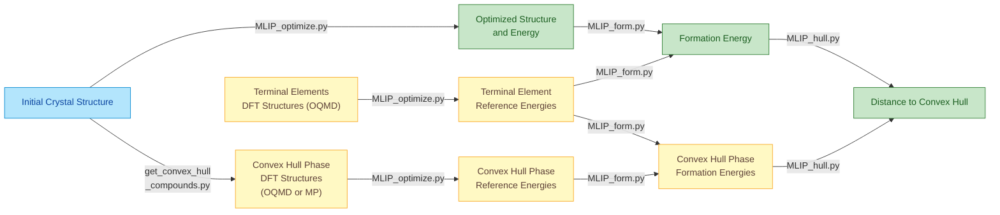

# MLIP-based High-throughput Optimization and Thermodynamics (MLIP-HOT)

A comprehensive toolkit for Machine Learning Interatomic Potential (MLIP) based calculations, including structural optimization, formation energy evaluation and convex hull analysis. This toolkit focuses on building a high-throughput pipeline for computational material discovery.

The method was described and applied in this work: https://arxiv.org/abs/2508.20556.  If this toolkit is used, please cite this work and the models used.


## Overview

This repository contains Python scripts and examples for:
- **Structural Optimization**: Optimize crystal structures using various MLIPs (CHGNet, MatterSim, eSEN, etc.)
- **Formation Energy Calculation**: Calculate formation energies using MLIP
- **Convex Hull Analysis**: Calculate distance to convex hull using MLIP

## Prerequisites

Before using this toolkit, you need to have **Miniconda** or **Anaconda** installed on your system. Miniconda is a minimal installer for conda, which is used to create isolated Python environments for different MLIP models.

**Installing Miniconda:**

1. Download Miniconda from the official website: https://docs.conda.io/en/latest/miniconda.html
2. Choose the installer for your operating system (Linux, macOS, or Windows)
3. Follow the installation instructions for your platform

**Verify Installation:**
```bash
conda --version
```

Once conda is installed, you can create separate environments for each MLIP model as described in the **MLIP Package Installation** section below.


## Key Features

- **MPI Parallelization**: Efficient processing of large datasets through distributed computing
- **Flexible Job Distribution**: Submit dataset chunks separately across multiple computing resources
- **Global Minimum Determination**: Identify the lowest-energy structure from multiple optimization runs with different initial configurations
- **Formation Energy Calculations**: Compute formation energies using MLIP-derived reference energies
- **Convex Hull Distance Analysis**: Evaluate thermodynamic stability through hull distance calculations with MLIP reference energies
- **High-Quality Reference Structures**: Utilize DFT-optimized structures from OQMD and Materials Project databases as initial geometries for reference energy calculations
- **Symmetrize**: The structure can be converted to primitive cell before optimization


## Available MLIP Models

This toolkit supports the following Machine Learning Interatomic Potential models:

- **CHGNet**: `chgnet` 
- **SevenNet variants**:
  - `7net-0` 
  - `7net-l3i5` 
  - `7net-mf-ompa` 
- **MatterSim**: `mattersim` 
- **EquiformerV2 (OMAT)**:
  - `eqV2_31M_omat` 
  - `eqV2_86M_omat` 
  - `eqV2_153M_omat` 
  - `eqV2_31M_omat_mp_salex` 
  - `eqV2_86M_omat_mp_salex` 
  - `eqV2_153M_omat_mp_salex` 
- **eSEN**: `esen_30m_oam`
- **HIENet**: `hienet` 

For MLIP installation instructions, please refer to the **MLIP package installation** section below.

The toolkit is designed with modularity in mind, allowing new MLIP models to be integrated seamlessly into the existing framework.

## Common Workflow

The MLIP-based structure optimization, formation energy calculation, and distance to convex hull calculation are performed following this sequential process:



## Usage Examples

An example input CSV file containing 100 compounds is included in the `example` directory. The following sections demonstrate typical usage for each script, concluding with a comprehensive workflow example that shows how to: (1) determine ground state structures and energies, (2) calculate formation energies, and (3) evaluate thermodynamic stability via convex hull distance.

**Important Notes:**

1. **Additional Options**: The examples below show basic usage. Each script supports additional flags for greater flexibility. Run `python script_name.py -h` to view all available options and usage examples.

2. **Hardware Requirements**: No GPU device is required. This toolkit applies pre-trained MLIPs and can run efficiently on CPU.

3. **MLIP Environment Management**: Before using this toolkit, install the MLIP package for your chosen model. Installation instructions for each MLIP are provided in the **MLIP Package Installation** section. We recommend installing each MLIP package in a separate conda environment. For the examples below using `mattersim`:

   ```bash
   conda create -n MLIP_mattersim python=3.9
   conda activate MLIP_mattersim
   pip install mattersim
   ```
 
### 1. Structure Optimization

#### Basic Structure Optimization

Optimize crystal structures using different MLIP models with `MLIP_optimize.py`. The input CSV file must contain columns `cell`, `positions`, and `numbers` defining the initial crystal structure. Refer to the example input CSV for format requirements. The optimized structure and corresponding energy are stored in columns `optimized_formula`, `optimized_cell`, `optimized_positions`, `optimized_numbers`, and `Energy (eV/atom)`. Details of the procedure and output are displayed during execution.

```bash
# Using mattersim model
mpirun -np 4 python MLIP_optimize.py \
    -d ./example_data.csv \
    -m "mattersim" \
    -o "result_test1"

# Flags:
#   -d, --data: Path to input CSV file containing crystal structures
#   -m, --model: MLIP model name (see Available MLIP Models section)
#   -o, --output: Output directory for optimization results
#   mpirun -np N: Run with N parallel processes using MPI
```

#### Optimization with Strain Perturbations

Apply strain perturbations before optimization to explore different initial structural configurations using the `--strain` flag. The strained structures are stored in columns `strained_cell`, `strained_positions`, and `strained_numbers`.

```bash
# Scalar input for isotropic strain
mpirun -np 10 python MLIP_optimize.py \
    -d ./example_data.csv \
    -m "mattersim" \
    -o "result_test1" \
    --strain 0.1

# 3x3 matrix for anisotropic strain
mpirun -np 10 python MLIP_optimize.py \
    -d ./example_data.csv \
    -m "mattersim" \
    -o "result_test1" \
    --strain "[[0.1, 0.1, 0.0], [0.1, -0.1, 0.0], [0.0, -0.1, 0.0]]"

# Flags:
#   --strain: Strain magnitude (scalar for isotropic, 3x3 matrix for anisotropic)
```

#### Submit Dataset Chunks Separately Across Multiple Computing Resources

In high-throughput research, the number of screened compounds is often very large. It is more efficient to divide the database into several chunks and run optimization of each chunk separately on multiple computation nodes. For example, divide the database into 20 chunks, run each chunk on one computer, and concatenate all results at the end. This is controlled by the `-s` and `-r` flags: `-s` specifies the number of chunks to generate, and `-r` specifies which chunk to process in the current calculation. After all chunks are calculated, results can be concatenated using `concat_csv.py`.

```bash
# Run optimization by separating database into 3 chunks
mpirun -np 10 python MLIP_optimize.py \
    -d ./example_data.csv \
    -m "mattersim" \
    -o "result_test1" \
    -s 3 \
    -r 0

# Flags:
#   -s: Number of chunks to split the database into
#   -r: Chunk index to process (0 <= r < s)

# Concatenate results from multiple chunks
python concat_csv.py \
    -f "./result_test1" \
    -p "example_data_*.csv" \
    -o example_data_result_test1.csv

# Flags:
#   -f: Folder path containing CSV files to concatenate
#   -p, --pattern: Glob pattern to match specific files (e.g., "*.csv", "data_*.csv")
#   -o, --output: Output CSV filename for concatenated results
```

The script `concat_csv.py` prints the names of files for concatenation and identifies any incomplete chunks.

#### Finding Global Minimum from Various Initial Structures

When initialized from different initial structures, optimization can converge to different structures (local minima) with different energies—the same behavior as DFT-based optimization. To determine the true ground state, compare the energies of local minima to find the global minimum using the `find_global_minimum.py` script. 


```bash
# Find global minimum energies across multiple result files
python find_global_minimum.py \
    -i example_data_result_test1.csv \
       example_data_result_test2.csv \
    -o example_data_result_global_min.csv

# Flags:
#   -i, --input: Multiple input CSV files to compare (space-separated list)
#   -o, --output: Output file containing structures with globally minimum energies
#   --labels: Optional custom labels for each input file (order matches input files)
```

To track which file the global minimum came from, the CSV file path is specified for each compound by default. Custom labels can be provided using the `--labels` flag (order matches input files).

### 2. Formation Energy Calculation

#### Definition

The **formation energy** of a compound is a thermodynamic quantity that measures the energy change when the compound is formed from its constituent elements in their standard reference states. It provides insight into the **stability** of a material — lower (more negative) formation energy generally indicates a more stable compound.

$$ E_\text{form} = E_{\text{compound}} - \sum_i n_i \mu_i $$
where:  
- $E_{\text{compound}}$: energy of the compound   
- $n_i$: number of atoms of element $i$ in the compound  
- $\mu_i$: chemical potential (typically the energy per atom) of element $i$.

#### Script Usage

To calculate formation energies, we need the energies of constituent elements. A `terminal_elements.csv` file containing all elements ground states structure from OQMD database is provided in the `example` folder. First, apply `MLIP_optimize.py` to optimize the terminal elements, then use the output along with the compound optimization results to calculate formation energies, using `MLIP_form.py` script 

```bash
# Step 1: Optimize terminal elements
mpirun -np 10 python MLIP_optimize.py \
    -d ./terminal_elements.csv \
    -m "mattersim" \
    -o "terminal_elements_energy"

# Step 2: Calculate formation energies
python MLIP_form.py \
    -i example_data_result_global_min.csv \
    -t terminal_elements_energy/terminal_elements.csv \
    -o example_data_result_formation_energy.csv

# Flags:
#   -i, --input: Input CSV file with optimized structures and energies
#   -t, --terminal: CSV file containing terminal element energies
#   -o, --output: Output file with calculated formation energies (eV/atom)
```

### 3. Convex Hull Analysis

#### Definition

The **distance to the convex hull** measures how far a compound's formation energy lies above the thermodynamic stability limit defined by all possible competing phases in a chemical system. It quantifies how unstable a compound is relative to the most stable combinations of phases at the same composition. 

$$ E_\text{hull} = E_\text{form} - E_\text{form}^\text{(hull)} $$

where:  
- $E_\text{form}$: formation energy of the compound,  
- $E_\text{form}^\text{(hull)}$: formation energy of the thermodynamically stable phase (or mixture of phases) at that composition, i.e., the energy on the convex hull.

#### Script Usage

To construct the convex hull of a chemical system using the same MLIP, obtain DFT structures from the OQMD or Materials Project database and use them as initial structures for MLIP optimization and formation energy calculation. With the convex hull compounds' formation energies and the formation energies of screened compounds, use the `MLIP_hull.py` script to calculate hull distances.

The example below uses DFT structures from the OQMD database via QMPY, an open-source Python library for OQMD database management and analysis.   

```bash
# Get competing phases from OQMD database
mpirun -np 10 python get_convex_hull_compounds_qmpy_rester.py \
    -d example_data.csv \
    -o convex_hull_compounds.csv

# Optimize convex hull phases and calculate formation energy
mpirun -np 10 python MLIP_optimize.py \
    -d ./convex_hull_compounds.csv \
    -m "mattersim" \
    -o "convex_hull_compounds_energy"

python MLIP_form.py \
    -i convex_hull_compounds_energy/convex_hull_compounds.csv \
    -t terminal_elements_energy/terminal_elements.csv \
    -o convex_hull_compounds_formation_energy.csv

# Calculate distance to convex hull
mpirun -np 4 python MLIP_hull.py \
    -d example_data_result_formation_energy.csv \
    -c convex_hull_compounds_formation_energy.csv \
    -o example_data_result_hull.csv

# Flags:
#   -d: CSV file of screening compounds with formation energies
#   -c: CSV file of convex hull compounds with formation energies
#   -o: Output file containing hull distance (eV/atom)
```

#### Other Scripts to Get Convex Hull Compounds Information

##### 1. Get Competing Phases from Materials Project

This requires an API key, which can be obtained here: https://materialsproject.org/api
```bash
mpirun -np 10 python get_convex_hull_compounds_mp_rester.py \
    -d example_data.csv \
    -o convex_hull_compounds.csv \
    --api_key='your_api_key_here'

# Flags:
#   --api_key: Materials Project API key
```

##### 2. Using OQMD Database on Local Machine

The OQMD database can be installed on a local machine following the instructions here: https://static.oqmd.org/static/docs/getting_started.html

```bash
mpirun -np 4 python get_convex_hull_compounds_qmpy.py \
    -d example_data.csv \
    -o convex_hull_compounds.csv
```

To use this script, configure the local database connection in the script:
```python
DEFAULT_DB_CONFIG = {
    'name': 'oqmd__v1_6',
    'user': 'user',
    'host': 'localhost',
    'password': 'password'  
}
```


### Complete Workflow Example

This example demonstrates a complete pipeline from structure optimization to hull distance calculation:

1. Multiple optimization runs with different strain perturbations to find global minima
2. Terminal element energy calculations for formation energy reference
3. Convex hull phase preparation and optimization
4. Formation energy and hull distance calculations

```bash
# Set environment variable for optimal performance
export OMP_NUM_THREADS=1    # Limit OpenMP threads to prevent oversubscription

# ============================================================================
# STEP 1: Structure Optimization with various initial structures
# ============================================================================
# Strain 1: Optimize with 0.1 strain, divided into 3 chunks
for ((r = 0; r < 3; r++)); do
    mpirun -np 10 python MLIP_optimize.py \
        -d ./example/example_data.csv \
        -m "mattersim" \
        -o "opt_strain01" \
        -s 3 \                  # Divide into 3 chunks
        -r $r \                 # Process chunk r (0, 1, or 2) 
        --strain 0.1
done

# Concatenate results from all chunks
python concat_csv.py \
    -f "./opt_strain01" \
    -p "example_data_*.csv" \
    -o example_data_opt_strain01.csv

# Strain 2: Optimize with 0.15 strain, divided into 3 chunks
for ((r = 0; r < 3; r++)); do
    mpirun -np 10 python MLIP_optimize.py \
        -d ./example/example_data.csv \
        -m "mattersim" \
        -o "opt_strain015" \
        -s 3 \
        -r $r \
        --strain 0.15
done

python concat_csv.py \
    -f "./opt_strain015" \
    -p "example_data_*.csv" \
    -o example_data_opt_strain015.csv

# Strain 3: Optimize without strain 
for ((r = 0; r < 3; r++)); do
    mpirun -np 10 python MLIP_optimize.py \
        -d ./example/example_data.csv \
        -m "mattersim" \
        -o "opt_no_strain" \
        -s 3 \
        -r $r
done

python concat_csv.py \
    -f "./opt_no_strain" \
    -p "example_data_*.csv" \
    -o example_data_opt_no_strain.csv

# ============================================================================
# STEP 2: Find Global Minimum 
# ============================================================================
python find_global_minimum.py \
    -i example_data_opt_strain01.csv \
       example_data_opt_strain015.csv \
       example_data_opt_no_strain.csv \
    -o example_data_global_min.csv

# ============================================================================
# STEP 3: Calculate Terminal Element Reference Energies
# ============================================================================
mpirun -np 10 python MLIP_optimize.py \
    -d ./example/terminal_elements.csv \
    -m "mattersim" \
    -o "terminal_elements_energy"

# ============================================================================
# STEP 4: Calculate Formation Energies for Optimized Structures
# ============================================================================
python MLIP_form.py \
    -i example_data_global_min.csv \
    -t terminal_elements_energy/terminal_elements.csv \
    -o example_data_formation_energy.csv

# ============================================================================
# STEP 5: Prepare Convex Hull Competing Phases
# ============================================================================
# Get competing phases from OQMD database using QMPY rester
mpirun -np 10 python get_convex_hull_compounds_qmpy_rester.py \
    -d example_data_global_min.csv \
    -o convex_hull_compounds.csv

# Optimize convex hull competing phases
mpirun -np 10 python MLIP_optimize.py \
    -d ./convex_hull_compounds.csv \
    -m "mattersim" \
    -o "convex_hull_compounds_energy"

# Calculate formation energies for convex hull phases
python MLIP_form.py \
    -i convex_hull_compounds_energy/convex_hull_compounds.csv \
    -t terminal_elements_energy/terminal_elements.csv \
    -o convex_hull_compounds_formation_energy.csv

# ============================================================================
# STEP 6: Calculate Distance to Convex Hull
# ============================================================================
mpirun -np 4 python MLIP_hull.py \
    -d example_data_formation_energy.csv \
    -c convex_hull_compounds_formation_energy.csv \
    -o example_data_final_results.csv

echo "Workflow complete! Final results in example_data_final_results.csv"
```

**Expected Output Files:**
- `example_data_global_min.csv`: Ground state structures with lowest energies
- `example_data_formation_energy.csv`: Formation energies (eV/atom) for all compounds
- `example_data_final_results.csv`: Final results including hull distances (eV/atom)

**Key Points:**

- Using multiple strain strategies increases the chance of finding true global minima
- Dividing datasets into chunks (`-s` and `-r` flags) enables parallel processing across different compute nodes
- The convex hull analysis requires target compounds, terminal elements, and competing phases to all be optimized with the same MLIP model
- In practice, convex hull compounds can be generated first, then optimization of screened compounds, elements, and convex hull compounds can run simultaneously 


## MLIP Package Installation

This section provides conda environment setup instructions for each supported MLIP model.

### CHGNet

Website: https://chgnet.lbl.gov/

```bash
conda create -n MLIP_chgnet python=3.10
conda activate MLIP_chgnet
pip install chgnet
```

### SevenNet

Website: https://github.com/MDIL-SNU/SevenNet

```bash
conda create -n MLIP_7net python=3.10
conda activate MLIP_7net
pip install sevenn
```

### MatterSim

Website: https://github.com/microsoft/mattersim

```bash
conda create -n MLIP_mattersim python=3.9
conda activate MLIP_mattersim
pip install mattersim
```

### HIENet

```bash
conda create -n MLIP_HIENet python=3.9
conda activate MLIP_HIENet

pip install torch==2.1.2
pip install torch-scatter torch-sparse torch-cluster torch-spline-conv -f https://data.pyg.org/whl/torch-2.1.2.html

git clone https://github.com/divelab/AIRS.git
cd AIRS/OpenMat/HIENet
pip install .
```

**Troubleshooting**: If you encounter the error `OSError: /lib64/libstdc++.so.6: version 'GLIBCXX_3.4.29' not found`, run:

```bash
conda install -c conda-forge libstdcxx-ng
```

### EquiformerV2 and eSEN

Website: https://huggingface.co/facebook/OMAT24/tree/main

```bash
conda create -n MLIP_fairchem python=3.9
conda activate MLIP_fairchem
pip install fairchem-core==1.10.0
pip install torch_scatter torch_sparse torch_spline_conv torch_geometric
```

**Note**: For EquiformerV2 and eSEN MLIPs, download the trained model checkpoints from the official website: https://huggingface.co/facebook/OMAT24/tree/main. Specify the checkpoint path when using these models with the `--checkpoint_path` flag:

```bash
mpirun -np 10 python MLIP_optimize.py \
    -d ./example/example_data.csv \
    -m "eqV2_31M_omat" \
    -o "opt_results" \
    --checkpoint_path ./fairchem_checkpoints/eqV2_31M_omat.pt
```

### GCC Version Issue

If your GCC version is too low, after activating the conda environment:

```bash
conda install -y -c conda-forge gcc=11.3.0
conda install -y -c conda-forge gxx=11.3.0
gcc --version
g++ --version
```


## Citation

If you use this toolkit in your research, please cite:

```bibtex
@misc{xiao2025accuratescreeningfunctionalmaterials,
  title={Accurate Screening of Functional Materials with Machine-Learning Potential and Transfer-Learned Regressions: Heusler Alloy Benchmark}, 
  author={Enda Xiao and Terumasa Tadano},
  year={2025},
  eprint={2508.20556},
  archivePrefix={arXiv},
  primaryClass={cond-mat.mtrl-sci},
  url={https://arxiv.org/abs/2508.20556}
}
```

Additionally, please cite the specific MLIP models you use in your work. Refer to the official documentation and publications for each model listed in the **Available MLIP Models** section.

