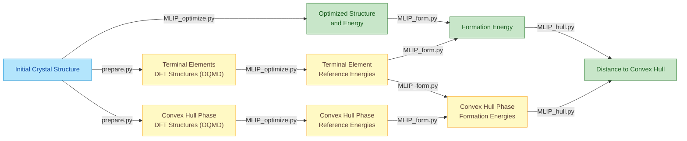

# MLIP-based High-throughput Optimization and Thermodynamics (MLIP-HOT)

A comprehensive toolkit for Machine Learning Interatomic Potential (MLIP) based
calculations, including structural optimization, formation energy evaluation and
convex hull analysis. This toolkit focuses on building a high-throughput pipline
for computational material discovery.


## Overview

This repository contains Python scripts and examples for:
- **Formation Energy Calculation**: Calculate formation energies using ML energies and reference terminal elements
- **Convex Hull Analysis**: Prepare competing phases from OQMD database and evaluate hull distances
- **Structural Optimization**: Optimize crystal structures using various ML force fields (CHGNet, EquiformerV2, etc.)
## Key Features

- **MPI Parallelization**: Efficient processing of large datasets through distributed computing
- **Flexible Job Distribution**: Submit dataset chunks separately across multiple computing resources
- **Global Minimum Determination**: Identify the lowest-energy structure from multiple optimization runs with different initial configurations
- **Formation Energy Calculations**: Compute formation energies using MLIP-derived reference energies
- **Convex Hull Distance Analysis**: Evaluate thermodynamic stability through hull distance calculations with MLIP reference energies
- **High-Quality Reference Structures**: Utilize DFT-optimized structures from OQMD and Materials Project databases as initial geometries for reference energy calculations


## Available MLIP Models

This toolkit supports the following Machine Learning Interatomic Potential models:

- **CHGNet**: `chgnet` 
- **SevenNet variants**:
  - `7net-0` 
  - `7net-l3i5` 
  - `7net-mf-ompa` 
- **MatterSim**: `mattersim` 
- **EquiformerV2 (OMAT)**:
  - `eqV2_31M_omat` 
  - `eqV2_86M_omat` 
  - `eqV2_153M_omat` 
  - `eqV2_31M_omat_mp_salex` 
  - `eqV2_86M_omat_mp_salex` 
  - `eqV2_153M_omat_mp_salex` 
- **eSEN**: `esen_30m_oam`
- **HIENet**: `hienet` 

The toolkit is designed with modularity in mind, allowing new MLIP models to be integrated seamlessly into the existing framework.

## Common Workflow

The MLIP-based structure optimization, formation energy calculation, and distance to convex hull calculation are performed following this sequential process:



## Usage Examples

### 1. Basic Structure Optimization

Optimize crystal structures using different MLIP models:

```bash
# Using CHGNet model
mpirun -np 4 python MLIP_optimize.py \
    -d ./example_data.csv \    # -d: Input CSV file containing structures
    -m "chgnet" \               # -m: MLIP model to use
    -o "result_test"            # -o: Output directory name
```

**Flags:**
- `-d, --data`: Path to input CSV file containing crystal structures
- `-m, --model`: MLIP model name (see Available MLIP Models section)
- `-o, --output`: Output directory for optimization results
- `mpirun -np N`: Run with N parallel processes using MPI

### 2. Optimization with Strain Perturbations

Apply strain perturbations to explore different structural configurations:

```bash
# Single strain value
mpirun -np 10 python MLIP_optimize.py \
    -d ./example_data.csv \    # -d: Input data file
    -m "chgnet" \               # -m: Model name
    -o "result_test" \          # -o: Output directory
    -s 1 \                      # -s: Number of strain perturbations
    -r 0 \                      # -r: Random seed for reproducibility
    --strain 0.1                # --strain: Strain magnitude (0.1 = 10%)

# Custom strain matrix
mpirun -np 10 python MLIP_optimize.py \
    -d ./example_data.csv \
    -m "7net-mf-ompa" \
    -o "result_test" \
    -s 3 \
    -r 0 \
    --strain "[[0.1, 0.1, 0.0], [0.1, -0.1, 0.0], [0.0, -0.1, 0.0]]"  # Custom strain tensor
```

**Flags:**

- `-s, --nstrains`: Number of random strain perturbations to apply
- `-r, --seed`: Random seed for reproducible strain generation
- `--strain`: Strain magnitude (float) or custom strain matrix (list of lists)

### 3. Multiple Optimization Runs with Different Seeds

Run multiple optimization attempts to find global minimum:

```bash
# Run optimization with different random seeds
for ((n = 0; n < 3; n++)); do
    mpirun -np 10 python MLIP_optimize.py \
        -d ./example_data.csv \
        -m "mattersim" \
        -o "result_test1" \
        -s 3 \                  # Apply 3 strain perturbations
        -r $n \                 # Use different seed for each iteration
        --strain 0.1 
done

# Concatenate results from multiple runs
python concat_csv.py \
    -f "./result_test1" \       # -f: Folder containing result files
    -p "example_data_*.csv" \   # -p: File pattern to match
    -o example_data_result_test1.csv  # -o: Output concatenated file
```

**Flags:**

- `concat_csv.py -f`: Folder path containing CSV files to concatenate
- `-p, --pattern`: Glob pattern to match specific files (e.g., "*.csv", "data_*.csv")
- `-o, --output`: Output filename for concatenated results

### 4. Finding Global Minimum from Multiple Runs

Compare results from different optimization strategies:

```bash
# Find global minimum energies across multiple result files
python find_global_minimum.py \
    -i example_data_result_test1.csv \    # -i: Input files (space-separated)
       example_data_result_test2.csv \
    -o example_data_result_global_min.csv # -o: Output file

# With labels for tracking sources
python find_global_minimum.py \
    -i example_data_result_test1.csv \
       example_data_result_test2.csv \
    --labels test1 test2 \                # --labels: Source labels for each input
    -o example_data_result_global_min.csv
```

**Flags:**

- `-i, --input`: Multiple input CSV files to compare (space-separated list)
- `--labels`: Optional labels to track which file each minimum came from
- `-o, --output`: Output file containing structures with globally minimum energies

### 5. Formation Energy Calculation

Calculate formation energies using terminal element references:

```bash
# Step 1: Optimize terminal elements
mpirun -np 10 python MLIP_optimize.py \
    -d ./terminal_elements.csv \    # CSV with pure element structures
    -m "mattersim" \
    -o "terminal_elements_energy"

# Step 2: Calculate formation energies
python MLIP_form.py \
    -i example_data_result_global_min.csv \        # -i: Input structures
    -t terminal_elements_energy/terminal_elements.csv \  # -t: Terminal element reference
    -o example_data_result_formation_energy.csv    # -o: Output with formation energies
```

**Flags:**

- `MLIP_form.py -i`: Input CSV file with optimized structures and energies
- `-t, --terminal`: Reference CSV file containing terminal element energies
- `-o, --output`: Output file with calculated formation energies (eV/atom)

### 6. Convex Hull Analysis

Prepare and analyze convex hull distances:

```bash
# Optimize convex hull phases
mpirun -np 10 python MLIP_optimize.py \
    -d ./convex_hull_phase.csv \    # Competing phases data
    -m "mattersim" \
    -o "convex_hull_phase"

# Get competing phases from QMPY database
mpirun -np 10 python get_convex_hull_compounds_qmpy_rester.py \
    -d example_data_10.csv \        # -d: Input structures to analyze
    -o tmp_competing_phases.csv     # -o: Output competing phases

# Get competing phases from Materials Project (requires API key)
mpirun -np 2 python get_convex_hull_compounds_mp_rester.py \
    -d example_data_10.csv \
    -o tmp_competing_phases.csv \
    --api_key='your_api_key_here'   # --api_key: Materials Project API key
```

**Flags:**

- `get_convex_hull_compounds_*_rester.py -d`: Input CSV with target compositions
- `-o, --output`: Output CSV file with competing phase structures from database
- `--api_key`: API key for Materials Project database access (MP only)
- Note: QMPY rester doesn't require an API key

### Complete Workflow Example

This example demonstrates a complete pipeline from structure optimization to hull distance calculation:

```bash
# Set environment variable for optimal performance
export OMP_NUM_THREADS=1    # Limit OpenMP threads to prevent oversubscription

# 1. Run multiple optimizations with different strain values
# Test strain = 0.1
for ((n = 0; n < 3; n++)); do
    mpirun -np 10 python MLIP_optimize.py \
        -d ./example_data.csv \
        -m "mattersim" \
        -o "result_test1" \
        -s 3 -r $n \            # 3 strains, seed varies from 0-2
        --strain 0.1 
done

python concat_csv.py -f "./result_test1" \
    -p "example_data_*.csv" -o example_data_result_test1.csv

# Test strain = 0.2
for ((n = 0; n < 3; n++)); do
    mpirun -np 10 python MLIP_optimize.py \
        -d ./example_data.csv \
        -m "mattersim" \
        -o "result_test2" \
        -s 3 -r $n \
        --strain 0.2 
done

python concat_csv.py -f "./result_test2" \
    -p "example_data_*.csv" -o example_data_result_test2.csv

# 2. Find global minimum across all optimization runs
python find_global_minimum.py \
    -i example_data_result_test1.csv \
       example_data_result_test2.csv \
    --labels test1 test2 \
    -o example_data_result_global_min.csv

# 3. Calculate formation energies
# First optimize terminal element references
mpirun -np 10 python MLIP_optimize.py \
    -d ./terminal_elements.csv \
    -m "mattersim" \
    -o "terminal_elements_energy"

# Then compute formation energies
python MLIP_form.py \
    -i example_data_result_global_min.csv \
    -t terminal_elements_energy/terminal_elements.csv \
    -o example_data_result_formation_energy.csv

# 4. Prepare convex hull analysis
# Get competing phases from QMPY database
mpirun -np 10 python get_convex_hull_compounds_qmpy_rester.py \
    -d example_data_10.csv -o tmp_competing_phases.csv

# Optimize the competing phases
mpirun -np 10 python MLIP_optimize.py \
    -d ./tmp_competing_phases.csv \
    -m "mattersim" \
    -o "convex_hull_phase"

# 5. Calculate hull distances
python MLIP_hull.py \
    -i example_data_result_formation_energy.csv \    # -i: Target structures
    -c convex_hull_phase/tmp_competing_phases.csv \  # -c: Competing phases
    -o example_data_hull_distances.csv               # -o: Output with hull distances
```

**Key Flags for MLIP_hull.py:**

- `-i, --input`: Input CSV with formation energies of target structures
- `-c, --competing`: CSV file with formation energies of competing phases
- `-o, --output`: Output file with calculated distances to convex hull (eV/atom)


