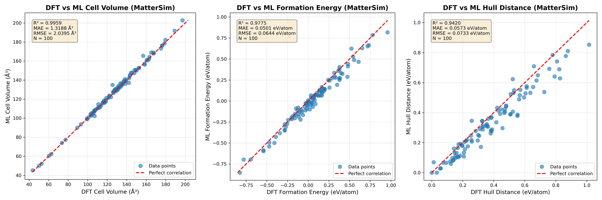

[日本語](README_ja.md) [中文](README_zh.md) 

# MLIP-based High-throughput Optimization and Thermodynamics (MLIP-HOT)

A comprehensive toolkit for Machine Learning Interatomic Potential (MLIP) based calculations, including structural optimization, formation energy evaluation and convex hull analysis. This toolkit focuses on building a high-throughput pipeline for computational material discovery. Key advantages of this toolkit are its ease of use and high performance.

The method is described and demonstrated in our paper:
https://arxiv.org/abs/2508.20556. If you use or extend MLIP-HOT, please cite this work.


## Overview

This code can do:
- **Structural Optimization**: Optimize crystal structures using various MLIPs (CHGNet, MatterSim, eSEN-30M-OAM, etc.)
- **Formation Energy Calculation**: Calculate formation energies using MLIP
- **Convex Hull Analysis**: Calculate distance to convex hull using MLIP

This repository also contains useful scripts for:
- **HTP Structure Generation**: Generate structures for screening compositions from a POSCAR or CIF input
- **Determine Global Minimum**: Determine the global minimum from several local minima.
  
#### Key Features

- **MPI Parallelization**: Efficient processing of large datasets through distributed computing
- **Flexible Job Distribution**: Submit dataset chunks separately across multiple computing resources
- **Global Minimum Determination**: Identify the lowest-energy structure from multiple optimization runs with different initial configurations
- **Formation Energy Calculations**: Compute formation energies using MLIP-derived reference energies
- **Convex Hull Distance Analysis**: Compute distance to convex hull using MLIP-derived reference energies
- **High-Quality Reference Structures**: Utilize DFT-optimized structures from OQMD as initial configurations for reference energy calculations
- **Relax from different initial structures perturbed strain**: Apply strain to structures before optimization is started.
- **Primitive Cell Conversion**: The structure can be converted to primitive cell before optimization to improve efficiency
- **No GPU device is required**: This toolkit applies pre-trained MLIPs and can run efficiently on CPU.


## Supported MLIP Models

This toolkit supports the following Machine Learning Interatomic Potential models:

- **CHGNet**: `chgnet` 
- **SevenNet variants**:
  - `7net-0` 
  - `7net-l3i5` 
  - `7net-mf-ompa` 
- **MatterSim**: `mattersim` 
- **EquiformerV2 (OMAT)**:
  - `eqV2_31M_omat` 
  - `eqV2_86M_omat` 
  - `eqV2_153M_omat` 
  - `eqV2_31M_omat_mp_salex` 
  - `eqV2_86M_omat_mp_salex` 
  - `eqV2_153M_omat_mp_salex` 
- **eSEN**: `esen_30m_oam`
- **HIENet**: `hienet` 

For MLIP installation instructions, please refer to the **MLIP package installation** section below.

The toolkit is designed with modularity in mind, allowing new MLIP models to be integrated seamlessly into the existing framework.


## Prerequisites

Before using this toolkit, you need to have **Miniconda** or **Anaconda** installed on your system. Miniconda is a minimal installer for conda, which is used to create isolated Python environments for different MLIP models.

**Installing Miniconda:**

1. Download Miniconda from the official website: https://docs.conda.io/en/latest/miniconda.html
2. Choose the installer for your operating system (Linux, macOS, or Windows)
3. Follow the installation instructions for your platform

**Verify Installation:**
```bash
conda --version
```

Once conda is installed, you can create separate environments for each MLIP model as described in the **MLIP Package Installation** section below.


## Usage

MLIP-HOT provides a single entrypoint (`scripts/MLIP_HOT.py`) to run the full pipeline (Structure optimization → Formation energy → Distance above convex hull) or any individual stage using YAML configs. 

We show examples covering:

1. Quick Start: A simple example running all three tasks at once.
2. Run a single task
3. Separate the job across multiple nodes for efficiency.
4. Determine the global minimum using multiple initial structures.
5. Generate input file from POSCAR, CIF, or numbers


### 1. Quick Start: A simple example running all three tasks at once.

#### Create Env and install MLIP
This example uses `MatterSim` MLIP. To create the conda environment and install MatterSim, do the following.

   ```bash
   conda create -n MLIP_mattersim python=3.9
   conda activate MLIP_mattersim
   pip install mattersim
   ```
 Installation instructions for other MLIPs are provided in the **MLIP Package Installation** section. We recommend installing each MLIP package in a separate conda environment. For the examples below using `mattersim`:

#### Structure optimization, formation energy, and hull distance calculation

An example input containing 10 compounds is included in the `example` directory.  This dataset is obtained from the [DXMag Computational HeuslerDB](https://www.nims.go.jp/group/spintheory/database/). Pre-computed results are also included to help verify your installation and compare outputs. 

Move into the `example` folder and perform the example calculation as below. This example should be finished within a few minutes on you personal computer.

```bash
# activate env if it is not activated
conda activate MLIP_mattersim 

# set path to the entry script
MLIP_HOT=../scripts/MLIP_HOT.py
# start computation described in the config file
python $MLIP_HOT -c pipeline.yaml 
```
If the example folder is copied to another place or the code is used in real practice, please change `MLIP_HOT=../scripts/MLIP_HOT.py` to the absolute path to `MLIP_HOT.py` on your computer.

> 💡 Quick Fix: If you meet an error message about a missing module, please install it. For example, if module `pyyaml` is missing, please do `pip install pyyaml` .


All settings are controlled by the config file `pipeline.yaml`. Now, let's explain the content in this config file. 

```yaml
# Select task: pipeline | optimize | form | hull
# pipeline would do optimize, form, and hull.
task: pipeline 
# Select interatomic potential model
# supported models are shown in Supported MLIP Models section
model: mattersim
# Optional global MPI settings, number of process
mpi_nproc: 10

# Stage 1: Optimization
optimize:
  input:  ./example.csv         # input csv file
  output: example_result_task1  # directory where results will be written
# Stage 2: Formation energy; use default settings
form:
# Stage 3: Hull distance; use default settings
hull:
```

The `input` file must include the columns `cell`, `positions`, and `numbers`, which define the crystal structure for relaxation. 
- **cell**: 3×3 matrix as list `[[a1,a2,a3], [b1,b2,b3], [c1,c2,c3]]`
- **positions**: Nx3 matrix as list containing fractional coordinates `[[atom1x,atom1y,atom1z], [atom2x,atom2y,atom2z]...]`
- **numbers**:   N length list containing atomic numbers `[atom1,atom2,...]` 
  
We also provide a script which generates input csv file from POSCAR file, CIF file, or numbers (see example 5). 

The toolkit writes the following output columns: `optimized_formula`, `optimized_cell`, `optimized_positions`, `optimized_numbers`, `Energy (eV/atom)`, `Formation Energy (eV/atom)`, and `Hull Distance (eV/atom)`. Progress and details are printed during execution. Outputs are appended as new columns and all original columns are preserved. We recommend including identifier columns such as `formula`, `composition`, or `ID` in the input file.

Another example input contaning 100 compounds is included in `example/more_input` , and the MLIP result is included in `example/results`. The top 10 rows of the result are also the results of the example of 10 compounds. The results by DFT are also included for comparison.

The following comparison figure of MatterSim MLIP and DFT results are generated using jupyter notebook `example/results/analysis.ipynb`.



#### Equivalent Command Line Interface (CLI)

The job can also be set using Command Line Interface (no config file); an equivalent CLI is:
```bash
# From the example folder
conda activate MLIP_mattersim 
MLIP_HOT=../scripts/MLIP_HOT.py

python $MLIP_HOT \
    --task pipeline \
    --model mattersim \
    --mpi_nproc 10 \
    --opt.input ./example.csv \
    --opt.output ./example_result_task1 
```

The optimized structures, formation energies, and hull distances are written to files in `example_result`.

>  💡Tip: You can use both a config file and CLI; CLI values overwrite config values.

### 2. Run a single task

Each stage (optimize/formation energy/hull distance) can be done separately. Example configs are:

```yaml
task: optimize
model: mattersim
mpi_nproc: 10
optimize:
  input:  ./example.csv         # input csv file
  output: example_result_task2  # directory where results will be written
```

```yaml
task: form 
model: mattersim
form:
    input:  example_result_task1/structure_optimization_result.csv
    output: example_result_task2/form_result.csv
```

```yaml
task: hull 
model: mattersim
mpi_nproc: 4
hull:
  input:  example_result_task2/form_result.csv
  output: example_result_task2/hull_result.csv
```

These example config files are also included in the `example` folder which can be executed using:

```bash
conda activate MLIP_mattersim 
MLIP_HOT=../scripts/MLIP_HOT.py

python $MLIP_HOT -c config2_single_task_optimize.yaml
python $MLIP_HOT -c config2_single_task_form.yaml
python $MLIP_HOT -c config2_single_task_hull.yaml
```  

The same task can also be performed using equivalent CLI:

``` bash
python $MLIP_HOT \
    --task optimize \
    --model mattersim \
    --mpi_nproc 4 \
    --optimize.input  ./example.csv \
    --optimize.output example_result_task2
```

``` bash
python $MLIP_HOT \
    --task form \
    --model mattersim \
    --form.input  example_result_task1/structure_optimization_result.csv \
    --form.output example_result_task2/form_result.csv
```

``` bash
python $MLIP_HOT \
    --task hull \
    --model mattersim \
    --mpi_nproc 4 \
    --hull.input  example_result_task2/form_result.csv \
    --hull.output example_result_task2/hull_result.csv
```

### 3. Separate the job across multiple nodes for efficiency.
In high-throughput research, the number of screened compounds is often very large. In `pipeline` or `optimize` task, it is more efficient to divide the input database into several chunks and run each chunk separately on multiple computation nodes. For example, divide the input to 20 chunks, run each chunk on one computer, and concatenate all results at the end. 

This can be performed using  `optimize.size` and `optimize.rank` flags: `size` specifies the number of chunks to generate, and `rank` specifies which chunk to process in the current calculation (from $0$ to $N_{size}-1$).

An example using 3 chunks is included in `example`: 

```bash
conda activate MLIP_mattersim 
MLIP_HOT=../scripts/MLIP_HOT.py

python $MLIP_HOT -c config3_size_rank.yaml --optimize.size 3 --optimize.rank 0
python $MLIP_HOT -c config3_size_rank.yaml --optimize.size 3 --optimize.rank 1
python $MLIP_HOT -c config3_size_rank.yaml --optimize.size 3 --optimize.rank 2
```
Please note that the config file is same as example 1. Just adding `size` and `rank` in CLI.

After all chunks are calculated, results can be concatenated using script `../script/concat_csv.py`.
```bash
# Concatenate results from multiple chunks
python ../scripts/concat_csv.py \
    -f "./example_result_task3" \
    -p "hull_distance_*.csv" \
    -o "example_result_task3/concat_result.csv"

#   -f, --folder:  Folder path containing CSV files to concatenate
#   -p, --pattern: Glob pattern to match files for concatenation 
#                  (e.g., "structure_optimization_result_*.csv", "hull_distance_*.csv")
#   -o, --output:  Output CSV filename for concatenated results
```
The script can concatenate any files with names following pattern `XX_{size}_{rank}.csv`.
 `concat_csv.py` prints the names of files concatenated and identifies any unfinished chunks. 


> 💡 Tip: The script `concat_csv.py` works for output of `pipeline` task and `optimize` task.

### 4. Determine the global minimum using multiple initial structures.
A compound might have several local minima, and only the global minimum is the true ground state. In such compound, different initial structures can relax to distinct local minima with different energies. The ground state is identified by selecting the lowest-energy structure. The same situation also happens in DFT-based optimization.

One way to do this is preparing multiple CSV files with different initial structures and running structure optimization on each. 

Another way is to apply different strains to the structure to generate different initial structures before relaxation. MLIP-HOT can do this easily using the `strain` flag. The strain can be either a scalar (Isotropic strain) or 3x3 matrix (Anisotropic strain). The generated structures before relaxation are also written to output.

We provide a simple example doing this:

```bash
MLIP_HOT=/Users/xiaoenda/WORK/y_git_repo/MLIP_HOT/scripts/MLIP_HOT.py   
python $MLIP_HOT -c config4_strain.yaml --optimize.strain "0.1" --optimize.output example_result_task4/strain1

MLIP_HOT=/Users/xiaoenda/WORK/y_git_repo/MLIP_HOT/scripts/MLIP_HOT.py   
python $MLIP_HOT -c config4_strain.yaml --optimize.strain "[[0.1, 0.1, 0.0], [0.1, -0.1, 0.0], [0.0, -0.1, 0.0]]" --optimize.output example_result_task4/strain2
```
> 💡 Tip: This feature can be combined with `size` and `rank` demonstrated previously.
> i.e. For each strain, use `size` and `rank` to divide input to several chunks and do concatenation after relaxation


After all calculations are finished, the global minimum can be identified using the script `find_global_minimum.py`.

```bash
# Find global minimum energies across multiple result files
python  /Users/xiaoenda/WORK/y_git_repo/MLIP_HOT/scripts/find_global_minimum.py \
    -i example_result_task4/strain1/hull_distance.csv \
       example_result_task4/strain2/hull_distance.csv \
    -o example_result_task4/global_min.csv \
    --energy-column "Energy (eV/atom)" \
    --group-by-column "composition" 

# Flags:
#   -i, --input:       Multiple input CSV files to compare (space-separated list)
#   -o, --output:      Output file containing ground state structures
#   --energy-column:   Name of the column containing energy values (default: Energy (eV/atom))
#   --group-by-column: Column name used to identify the compound, (default: use index) 
#                      i.e. entries with same value are regarded as the same compound.
```

For more features of this script, please run `python ../scripts/find_global_minimum.py -h`.

> 💡 Tip: This script works for output of pipeline, optimize, form, and hull task.

### 5. Generate input file from POSCAR, CIF, or numbers

We provide a simple example in `example/generate_input` demonstrating how to generate input files. The example loads structures from POSCAR, CIF, or numbers, then creates new structures by replacing atoms with different elements. The resulting structures are saved to a CSV file that can be used directly as input to MLIP-HOT. We hope this example will help you create scripts tailored to your specific use case. To keep this document concise, detailed explanations are included in the notebook itself rather than here.  

For users working with `pymatgen` structures, input files can be generated from a list of structures using the code block below. Users more familiar with `ASE` and `phonopy` can easily convert those structures to pymatgen format using functions in `pymatgen` module.

``` python
# structures_list contains pymatgen structures
data_list = []
for idx, modified_structure in enumerate(structures_list):
    cell      = str(modified_structure.lattice.matrix.tolist())
    positions = str(modified_structure.frac_coords.tolist())
    numbers   = str(list(modified_structure.atomic_numbers))
    composition    = str(modified_structure.composition.hill_formula.replace(" ", ""))
    
    data_list.append({
        'index': idx,
        'composition': composition,
        'cell':      cell,
        'positions': positions,
        'numbers':   numbers
    })

df_structures = pd.DataFrame(data_list)
output_csv_path = "generated_structures.csv"
df_structures.to_csv(output_csv_path, index=False)
```

## MLIP Package Installation

This section provides conda environment setup instructions for each supported MLIP model.

### CHGNet

Website: https://chgnet.lbl.gov/

```bash
conda create -n MLIP_chgnet python=3.10
conda activate MLIP_chgnet
pip install chgnet
```

### SevenNet

Website: https://github.com/MDIL-SNU/SevenNet

```bash
conda create -n MLIP_7net python=3.10
conda activate MLIP_7net
pip install sevenn
```

### MatterSim

Website: https://github.com/microsoft/mattersim

```bash
conda create -n MLIP_mattersim python=3.9
conda activate MLIP_mattersim
pip install mattersim
```

### HIENet

Website: https://github.com/divelab/AIRS/tree/main/OpenMat/HIENet

```bash
conda create -n MLIP_HIENet python=3.9
conda activate MLIP_HIENet

pip install torch==2.1.2
pip install torch-scatter torch-sparse torch-cluster torch-spline-conv -f https://data.pyg.org/whl/torch-2.1.2.html

git clone https://github.com/divelab/AIRS.git
cd AIRS/OpenMat/HIENet
pip install .
```

**Troubleshooting**: If you encounter the error `OSError: /lib64/libstdc++.so.6: version 'GLIBCXX_3.4.29' not found`, run:

```bash
conda install -c conda-forge libstdcxx-ng
```

### EquiformerV2 and eSEN

Website: https://github.com/facebookresearch/fairchem
Website: https://huggingface.co/facebook/OMAT24/tree/main

The EquiformerV2 and eSEN MLIPs are implemented within FAIRChem version 1.10.0, which can be installed as follows:


```bash
conda create -n MLIP_fairchem python=3.9
conda activate MLIP_fairchem
pip install fairchem-core==1.10.0
pip install torch_scatter torch_sparse torch_spline_conv torch_geometric
```

**Note**: For EquiformerV2 and eSEN MLIPs, the trained model checkpoints are not included in the FAIRChem package and must be downloaded separately from the official website: https://huggingface.co/facebook/OMAT24/tree/main. When using these models, specify the checkpoint path with the `--checkpoint_path` flag:

```bash
mpirun -np 10 python ../scripts/MLIP_optimize.py \
    -d ./example/example_data.csv \
    -m "eqV2_31M_omat" \
    -o "opt_results" \
    --checkpoint_path ./fairchem_checkpoints/eqV2_31M_omat.pt
```


## Thermodynamic Stability Metrics: Formation Energy and Convex Hull
### 1. Formation Energy Calculation

The **formation energy** of a compound is a thermodynamic quantity that measures the energy change when the compound is formed from its constituent elements in their standard reference states. It provides insight into the **stability** of a material — lower (more negative) formation energy generally indicates a more stable compound.

$$ E_\text{form} = E_{\text{compound}} - \sum_i n_i \mu_i $$
where:  
- $E_{\text{compound}}$: energy of the compound   
- $n_i$: number of atoms of element $i$ in the compound  
- $\mu_i$: chemical potential (typically the energy per atom) of element $i$.

### 2. Distance above Convex Hull

The **distance to the convex hull** measures how far a compound's formation energy lies above the thermodynamic stability limit defined by all possible competing phases in a chemical system. It quantifies how unstable a compound is relative to the most stable combinations of phases at the same composition. 

$$ E_\text{hull} = E_\text{form} - E_\text{form}^\text{(hull)} $$

where:  
- $E_\text{form}$: formation energy of the compound,  
- $E_\text{form}^\text{(hull)}$: formation energy of the thermodynamically stable phase (or mixture of phases) at that composition, i.e., the energy on the convex hull.


## Citation

If you use this toolkit in your research, please cite:

```bibtex
@misc{xiao2025accuratescreeningfunctionalmaterials,
  title={Accurate Screening of Functional Materials with Machine-Learning Potential and Transfer-Learned Regressions: Heusler Alloy Benchmark}, 
  author={Enda Xiao and Terumasa Tadano},
  year={2025},
  eprint={2508.20556},
  archivePrefix={arXiv},
  primaryClass={cond-mat.mtrl-sci},
  url={https://arxiv.org/abs/2508.20556}
}
```

Additionally, please cite the specific MLIP models you use in your work. Refer to the official documentation and publications for each model listed in the **Available MLIP Models** section.


## Troubleshooting

#### GCC Version Issues

If you encounter errors related to an outdated GCC version, you can upgrade GCC within your conda environment using the following commands:

```bash
conda install -y -c conda-forge gcc=11.3.0
conda install -y -c conda-forge gxx=11.3.0
gcc --version
g++ --version
```

**Note**: Make sure your conda environment is activated before running these commands.

## [Extra] Scripts to Get Convex Hull Compounds Information via API

To improve efficiency, we precomputed convex-hull compounds from OQMD and evaluated them using MLIPs. These results are stored as reference files, so convex-hull distances can be computed directly.

Because the database continues to grow and reference-file updates may occasionally lag, we also provide scripts to retrieve convex-hull compounds from OQMD or the Materials Project (MP) via their APIs. For complete instructions, see [docs/get_convex_hull_compounds.md](docs/get_convex_hull_compounds.md)
